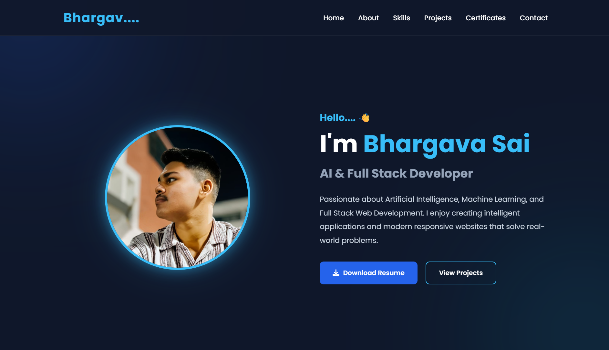
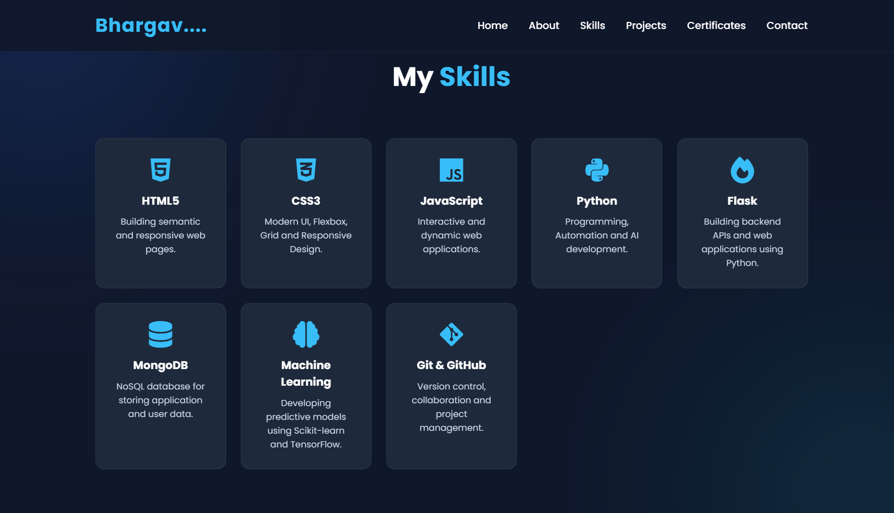
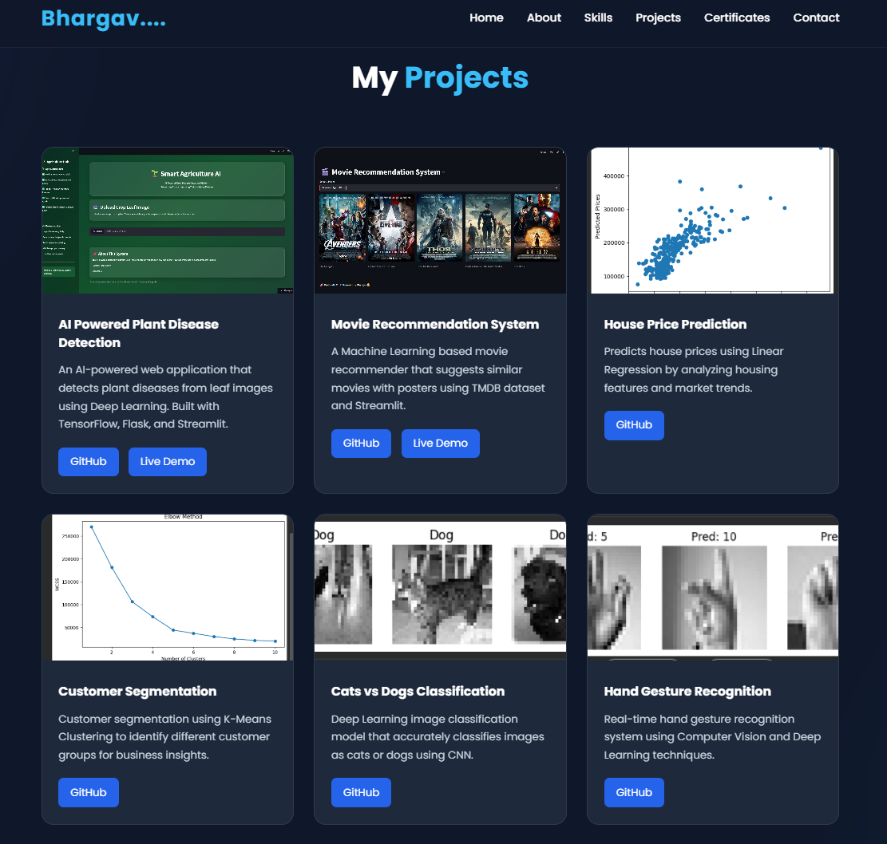
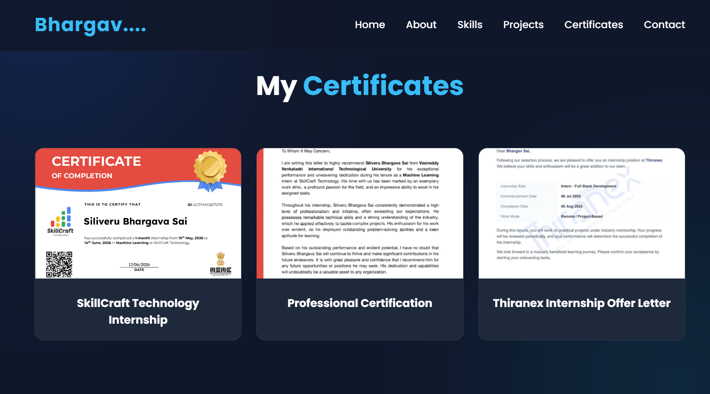
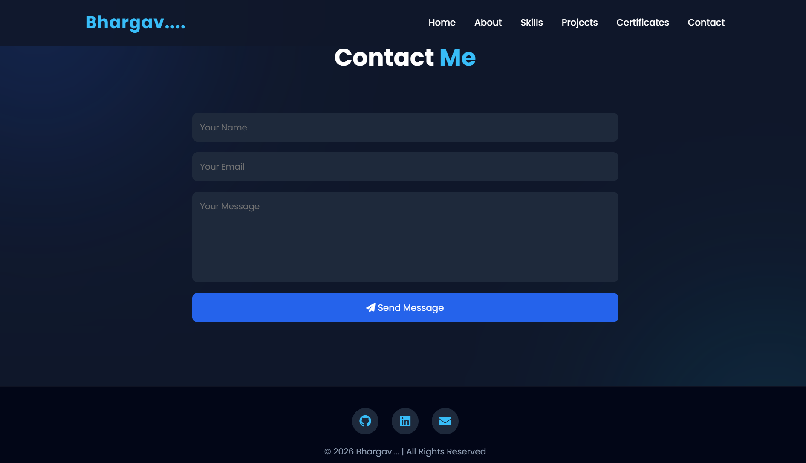

<div align="center">

# 🌐 Thiranex Portfolio Website

### 🚀 A Modern Developer Portfolio Built with Flask

<p>
A professional, fully responsive portfolio website developed using <strong>Flask</strong>, <strong>HTML</strong>, <strong>CSS</strong>, and <strong>JavaScript</strong>. This project was created during my internship to showcase my projects, technical skills, certifications, and achievements through a clean, interactive, and modern user interface.
</p>

<p>


</p>

### 🌍 Live Website

### **https://thiranex-portfolio-2-ma6z.onrender.com**

</div>

---

# 📖 About The Project

The **Thiranex Portfolio Website** is a responsive developer portfolio designed to present my technical profile in a professional way.

It highlights my:

- 👨‍💻 Technical Skills
- 🚀 Machine Learning & AI Projects
- 📜 Certifications
- 📄 Resume
- 📬 Contact Information

The website focuses on modern UI design, responsive layouts, smooth navigation, and an attractive user experience.

---

# ✨ Features

- 🎨 Modern & Professional UI
- 📱 Fully Responsive Design
- ⚡ Smooth Scrolling Navigation
- 👨‍💻 About Me Section
- 💻 Skills Showcase
- 🚀 Projects Gallery
- 📜 Certifications Section
- 📄 Resume Download
- 📬 Contact Form
- 🎯 Interactive Hover Effects
- 🔥 Clean & Organized Layout

---

# 🛠️ Tech Stack

| Category | Technologies |
|-----------|--------------|
| Frontend | HTML5, CSS3, JavaScript |
| Backend | Python, Flask |
| Database | MongoDB Atlas *(Integration Ready)* |
| Deployment | Render |
| Version Control | Git & GitHub |

---

# 📂 Project Structure

```text
Thiranex_Portfolio/
│
├── static/
│   ├── images/
│   ├── style.css
│   └── script.js
│
├── templates/
│   └── index.html
│
├── app.py
├── requirements.txt
├── .env
└── README.md
```

---

# 📸 Project Preview

## 🏠 Home Page



---

## 💻 Skills Section



---

## 🚀 Projects Section



---

## 📜 Certifications Section



---

## 📬 Contact Section



---

# 🚀 Installation

## Clone Repository

```bash
git clone https://github.com/bhargavasaiii17-svg/Thiranex_Portfolio.git
```

---

## Navigate to Project

```bash
cd Thiranex_Portfolio
```

---

## Install Dependencies

```bash
pip install -r requirements.txt
```

---

## Run Flask Server

```bash
python app.py
```

---

## Open in Browser

```
http://127.0.0.1:5000
```

---

# 🎯 Key Highlights

✅ Professional Portfolio Design

✅ Flask Backend Integration

✅ Responsive Across Devices

✅ Organized Project Showcase

✅ Modern User Interface

✅ Ready for Future MongoDB Integration

✅ Live Deployment using Render

---

# 📚 Learning Outcomes

This project helped me gain practical experience in:

- Flask Web Development
- Responsive Web Design
- Frontend & Backend Integration
- Git & GitHub Workflow
- Render Deployment
- MongoDB Atlas Integration
- Professional Portfolio Development
- Project Structuring
- Deployment Best Practices

---

# 🚀 Future Enhancements

- 🔐 User Authentication
- 🌙 Dark / Light Theme Toggle
- 📊 Visitor Analytics Dashboard
- 💬 AI Chat Assistant
- 📧 Email Notifications
- 🌍 Custom Domain Integration
- 📱 Progressive Web App (PWA)
- ☁️ Cloud Storage Support

---

# 👨‍💻 Developer

## **Bhargav Sai**

**AI & Machine Learning Enthusiast**

---

# 🔗 Connect With Me

### 🌐 Portfolio

https://thiranex-portfolio-2-ma6z.onrender.com

### 💻 GitHub

https://github.com/bhargavasaiii17-svg

### 💼 LinkedIn

https://www.linkedin.com/in/bhargava-sai-3a2b43349

---

# 🙏 Acknowledgements

This project was developed during my internship at **Thiranex**, where I had the opportunity to strengthen my skills in modern web development by building a professional portfolio using **Flask**, **HTML**, **CSS**, and **JavaScript**.

I sincerely thank **Thiranex** for providing the opportunity to apply my technical knowledge in a real-world development environment.

---

# ⭐ Support

If you found this project useful,

⭐ Star this repository

🍴 Fork this repository

📢 Share it with others

---

<div align="center">

### ⭐ Thank you for visiting this repository!

**If you like this project, don't forget to leave a ⭐ on GitHub.**

Made with ❤️ by **Bhargav Sai**

</div>
